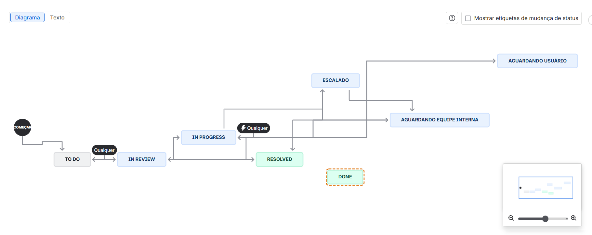
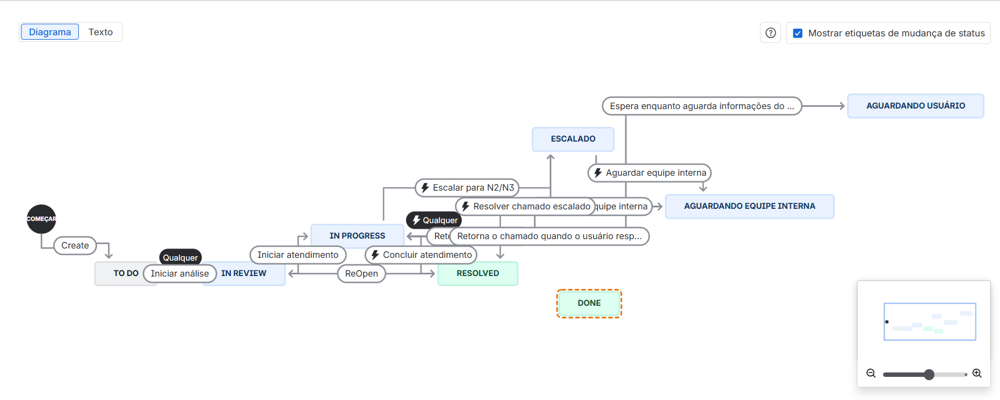
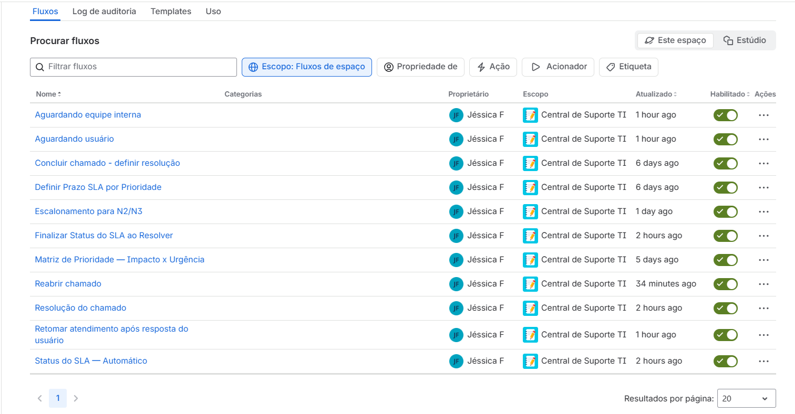
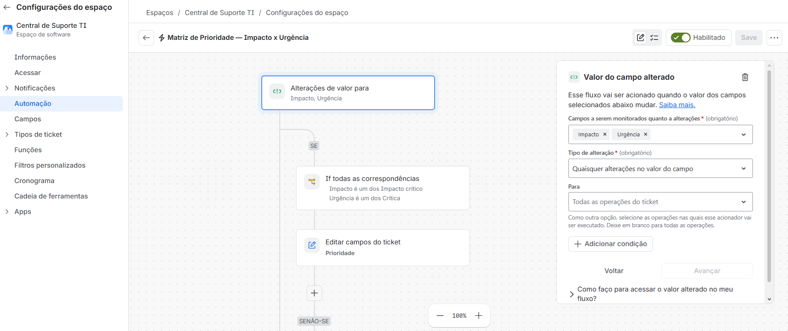
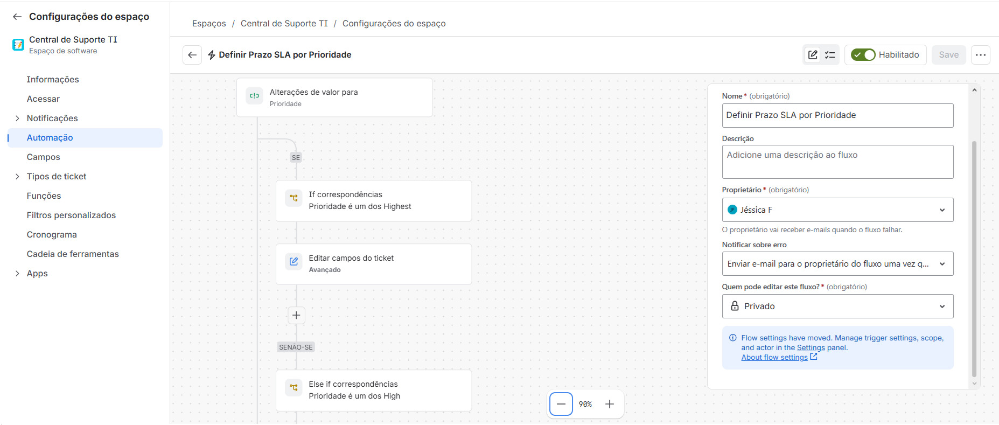
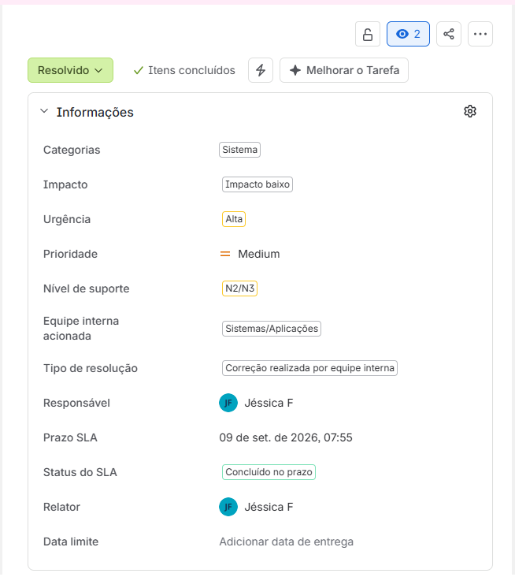
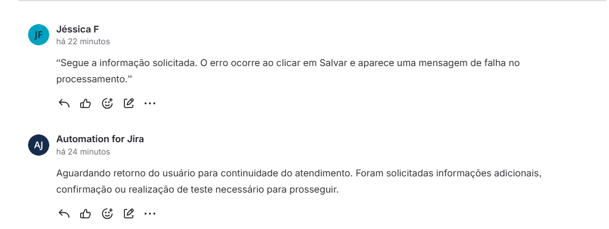
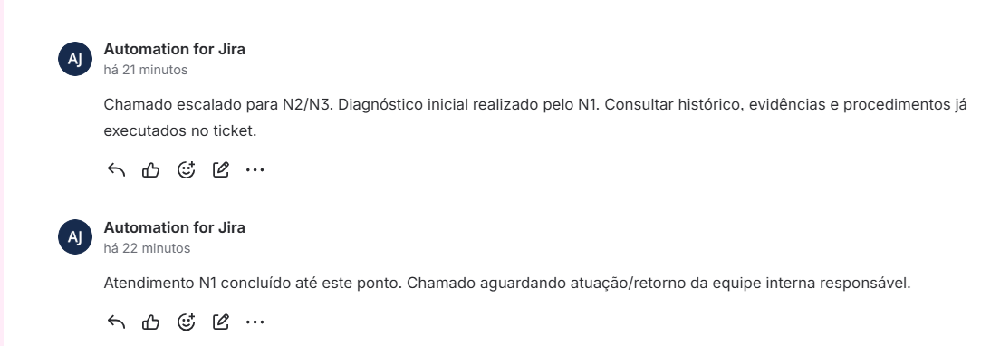

# Central de Suporte TI — Jira

Projeto prático desenvolvido para simular a operação de uma Central de Service Desk, contemplando o ciclo completo de atendimento de chamados, priorização, controle de SLA, escalonamento e resolução.

O objetivo do laboratório foi aplicar conceitos utilizados em rotinas de Suporte Técnico N1/N2 e Service Desk em um ambiente prático no Jira.

**Tecnologias e conceitos:** Jira • Automação • ITSM • SLA • Service Desk • Workflow • Escalonamento N1/N2/N3

## Funcionalidades implementadas

- Workflow personalizado para atendimento de chamados
- Classificação por Impacto e Urgência
- Priorização automática dos tickets
- Definição automática de prazo de SLA
- Monitoramento do status do SLA
- Identificação de chamados dentro do prazo, próximos do vencimento e vencidos
- Classificação da conclusão como dentro ou fora do SLA
- Fluxo de aguardando usuário
- Retomada automática após resposta do solicitante
- Fluxo de aguardando equipe interna
- Escalonamento de chamados para N2/N3
- Registro da equipe interna acionada
- Tipo de resolução obrigatório
- Reabertura de chamados com limpeza da resolução anterior
- Comentários automáticos para registro do histórico

## Workflow

Fluxo principal:

`TO DO → IN REVIEW → IN PROGRESS → RESOLVED`

Também foram implementados os status:

- Aguardando usuário
- Aguardando equipe interna
- Escalado

### Transições configuradas

## Automações

O projeto utiliza automações para reduzir ações manuais e padronizar o tratamento dos chamados.

### Matriz de prioridade

A prioridade do ticket é definida automaticamente a partir da combinação entre **Impacto** e **Urgência**.

Exemplo:

`Impacto + Urgência → Prioridade`

### SLA por prioridade

Após a definição da prioridade, o Jira calcula automaticamente o prazo para resolução:

| Prioridade | Prazo |
|---|---:|
| Highest | 2 horas |
| High | 4 horas |
| Medium | 8 horas |
| Low | 24 horas |
| Lowest | 48 horas |

## Escalonamento e resolução

Os chamados podem ser escalados do atendimento N1 para N2/N3, com registro da equipe interna responsável.

Antes da resolução, o campo **Tipo de resolução** deve obrigatoriamente ser preenchido.

Exemplos de tipos de resolução:

- Ajuste de configuração
- Correção de hardware
- Correção de rede/conectividade
- Correção de software/aplicação
- Correção realizada por equipe interna
- Orientação ao usuário
- Reset/desbloqueio de acesso
- Sem falha identificada

### Exemplo de chamado concluído

## Aguardando usuário

Quando são necessárias informações adicionais, o chamado pode ser colocado em **Aguardando usuário**.

A automação registra a espera no histórico e, quando o solicitante responde, o ticket retorna automaticamente para **Em andamento**.

## Aguardando equipe interna e escalonamento

Quando o atendimento depende de outra equipe, é obrigatório informar a **Equipe interna acionada**.

O Jira registra automaticamente a mudança no histórico e também documenta o escalonamento para N2/N3.

## Teste de ponta a ponta

Foi realizado um teste completo simulando um incidente em um sistema financeiro.

Fluxo utilizado:

`TO DO → Em análise → Em andamento → Aguardando usuário → Em andamento → Aguardando equipe interna → Em andamento → Escalado → Resolvido`

Resultado final:

- Categoria: Sistema
- Impacto: Baixo
- Urgência: Alta
- Prioridade calculada: Medium
- Nível de suporte: N2/N3
- Equipe interna: Sistemas/Aplicações
- Tipo de resolução: Correção realizada por equipe interna
- Status final: Resolvido
- SLA: Concluído no prazo

## Competências praticadas

- Service Desk
- Help Desk
- Gestão de chamados
- Jira
- ITSM
- SLA
- Troubleshooting
- Priorização de incidentes
- Impacto e urgência
- Escalonamento N1/N2/N3
- Documentação de atendimentos
- Workflow
- Automação de processos

## Objetivo do projeto

Este projeto foi desenvolvido como laboratório prático para consolidar conhecimentos relacionados à rotina de **Suporte Técnico, Help Desk, Service Desk e Suporte a Sistemas**, aproximando o estudo de cenários encontrados em ambientes corporativos.
